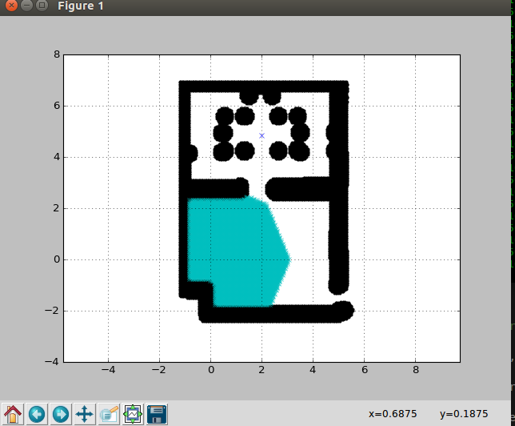
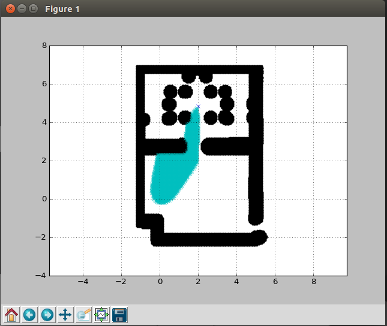
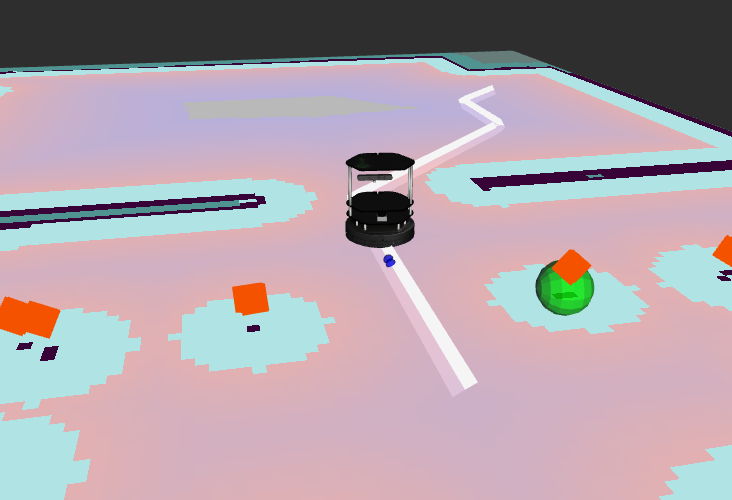
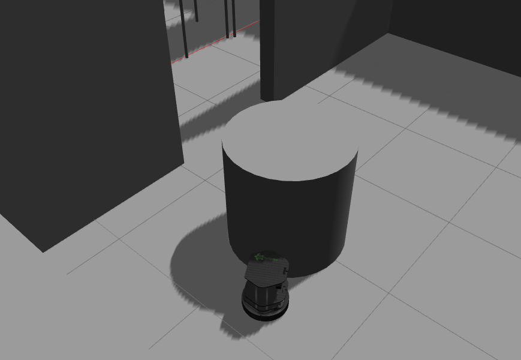
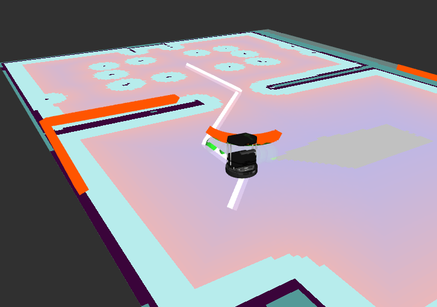
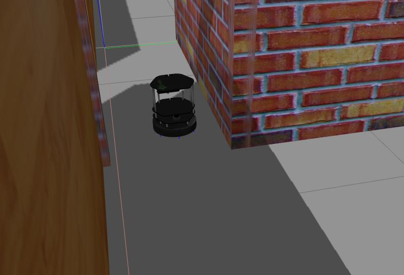
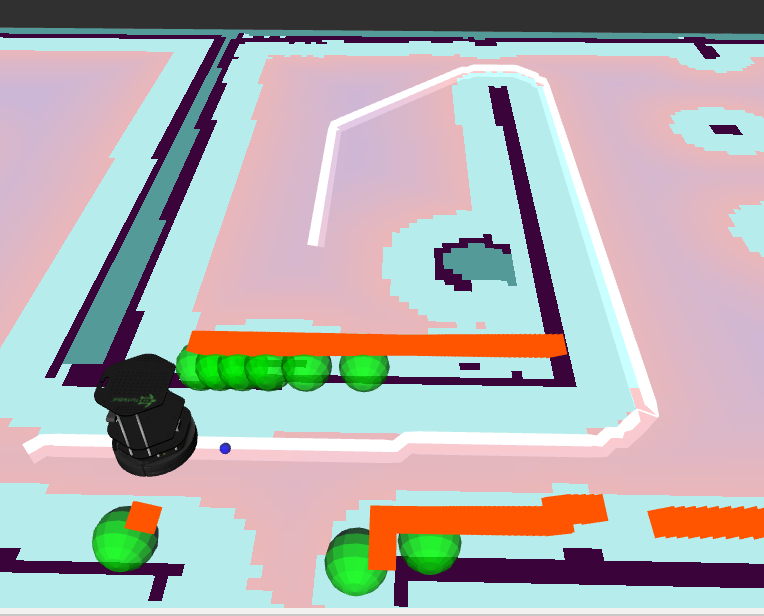

# Robotic Challenge
Robotic challenge in three different scenarios where turtlebot must reach a goal passed as a parameter, planning a path and avoiding obstacles while trying to perform in the shortest time possible.
The code for the three different scenarios are the same, but parameters are different.
-  **Challenge 1:** Room with all obstacles defined in map which are considered in planning phase
- **Challenge 2**: Room with at least an obstacle undefined in map that can't be considered in planning phase
- **Challenge 3:** Robotics labs that could have obstacles.
## Credits
[Luis Merino](https://github.com/lmercab)  
[David Alejo Teissière](https://github.com/david-alejo)  
[PyOrca Algorithm To avoid obstacles](https://github.com/Muon/pyorca)  
[Python Robotics algorithms](https://github.com/AtsushiSakai/PythonRobotics)  
# Nodes
- [Control Node](#control-node)
- [Orca Node](#orca-node)
- [Planner Node](#planner-node)
## Control Node:
##### Gestiona la ruta a seguir y la dirección a seguir
### Topics:
##### Publisher:
 - Twist **/cmd_vel/tracker**
 - Twist **/cmd_vel_mux/input/navi**
 - Marker **/visualization_marker**
##### Subscriber:
 -  Bool **/is_goal_within_obstacle**
 -  Path **/path_plan**
### Parameters:
 -  Path **path:** List of points the robot must follow,undefined until callback from /path_plan.
 -  Bool **path_set:** Variable to know if path has already been defined or not.
 -  Bool **skipping_goal:** Defines if orca had a problem finding a new movement to avoid obstacles, set in callback from /is_goal_within_obstacle
 -  Float **skip_goal_max_distance:** Max distance where a goal will be skipped if skipping_goal is True
 - Float **goal_tolerance:** Distance where a goal will be considered reached.
 - Float **linear_max:** Max linear speed robot will be able to move.
 - Float **angular_max:** Max angular speed robot will be rotating.
 - Float **angle_tolerance:** Degrees where the robot will move slower and adjust the rotation.
 - Float **linear_turning:** Speed the robot will be moving when turning to achieve the degrees to goal defined in angle_tolerance.
### Functions:
  - **__main__**: It initializes the node and defines the time ratio to which the command function will be executed, by which iterates the points of the path.
 - **command ( Int i )**:  calculates the linear and angular speed to achieve the current goal without exceed the limits defined, also manages if a goal in path should be skipped when called from /is_goal_within_obstacle , if the goal should be skipped it will calculate a new linea and angular velocity . 
Returns the current or next index in path , and a boolean to determine if the current goal was reached.
 - **path_received ( Path path )**: callback of /path_plan which sets the path.
 - **skip_goal ( Bool skipping_goal )**: callback of /is_goal_within_obstacle which sets skipping_goal to true if the goal is unreachable by orca.
 - **robot_closer_next_goal ( Int i )**: Returns the next point of the path that is closer to the current position of turtlebot
 - **publish ( Float lin_vel Float ang_vel )**: publish to the /cmd_vel/tracker topic the  desirable speed which will be sent to Orca node.
 - **publish_navi ( Float lin_vel,Float ang_vel )**: publish to the /cmd_vel_mux/input/navi topic the speed to move, this function will only be called if skipping_goal is set to true, as a way to resolve a local minimun in with orca algorithm.
 - **marker_goal ( Float goalx,Float goaly )**: Publish to /visualization_marker the next goal so we can visualize it in rviz.
## Orca Node:
##### Encargado de evitar los obstaculos recibidos por el radar y por tanto transformar la velocidad que llega de  control node a una en la que evite estos obstaculos, si no es posible enviara una señal a control para resolver el problema.
### Topics:
##### Publisher:
 - Twist **/cmd_vel_mux/input/navi**
 -  Bool **/is_goal_within_obstacle**
 - Marker **/visualization_marker**
##### Subscriber:
 - Twist **/cmd_vel/tracker**
 - LaserScan **/scan**
### Parameters:
 -  Float **linear_threshold:** Threshold where if isn't exceeded orca won't take action.
 -  Float **linear_max:** Max linear speed robot will be able to move.
 -  Float **radius:** Radius of the obstacle, which are named Agents in orca.
 -  Float **delta_t:** Time between every call to orca, which is defined as rate of sleep.
 -  Float* **max_distance_obstacle:** Max distance where a obstacle will be considered by orca to be avoided
 -  Array **v_orca:** Speed considered for orca in vector 
 -  Float **linear:** Linear speed to be published after being calculated
 -  Float **angular:** Angular speed to be published after being calculated
### Functions:
  - **__main__**: It initializes the node and sets it to sleep while not shutdown has been invoked.
  - **callback_cmd_vel ( Float [] data)**: Invoked if received from /cmd_vel/tracker, transform the speed in to a vector and saves it as v_orca, as it will be used by orca.
  - **callback_scan ( LaserScan Data)**: analyzes the obstacles retrieved from LaserScan, filters the ones who are farther than max_distance_obstacle, and transform v_orca in a new vector to avoid the obstacles.
  - **publish ( Float lin_vel, Float ang_vel)**: publish the calculated velocity to turtlebot.
  - **orca_apply ( Agent [] agents)**: calls orca algorithm to resolve which direction must the robot move to avoid obstacles. More info in their own repo linked in credits.
 
## Planner Node:
##### Will calculate a path to the goal avoiding obstacles defined in the costmap, this will be calculated once. We will be using an a -star algorithm considering both the travelled distance and the distance to goal.
### Topics:
##### Publisher:
 - Marker **/path**
 -  Path **/path_plan**
##### Subscriber:
 - OccupancyGrid **/costmap_2d/costmap/costmap**
### Parameters:
 -  String **goal_path:** File path to save the path plan.
 -  Float [] **init:** Init coords where the robot will start the path.
 -  Float [] **goal:** Goal coords that the robot must reach
### Functions:
  - **__main__**: It initializes the node and sets it to sleep while not shutdown has been invoked.
  - **map_callback**: Retrieves the information from /costmap_2d/costmap/costmap and calls calculate_pat, publish_path_msg, publish_path_marker, and finally saveAsYaml functions
  - **calculate_path (Float [] init, Float [] goal)**:  will call the dijkstra algorithm that is modified to work as an AStar algorithm, and return the points that compose the path.
  - **publish_path_msg(Path path)**: Once calculated by calculate_path this will reverse the list of points as they come from the goal to init, and it will publish in /path_plan topic so the robot can star following it.
  - **publish_path_marker(path path)**: This will publish the path as Markers so rviz can visualize it.
  - **save_as_yaml(Path path)**: Saves the path as a yaml so a node can read it as ros params, this was used before the topic path_plan was created.
 ### Comparision between astar and dijkstra planning
 Points explored with Dijksta algorithm
 
  Points explored with AStar algorithm
 
 
 ### Images
 #### Challenge 1,2:
 Challenge 1 being completed, image from rviz
 
 Challenge 2 being completed, image from gazebo
 
 Challenge 2 being completed, image from rviz
 
 #### Challenge 3:
 Challenge 3 being completed, image from gazebo
 
 Challenge 3 being completed, image from rviz
 
